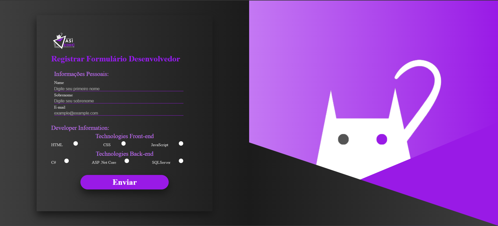

## Projeto de Criação de formulário Estático ASI CODE

## Objetivo 
Criar um formulário para cadastro de usuário Dev como exeercício prático de web

## Visão Geral 
Icones para selecionar o tipo de prato para ser exibido com painel de ingredientes e modo de preparo 

## Tecnologias Utilizadas

- **HTML:** 

- **CSS:** 

- **JAVASCRIPT:** 

